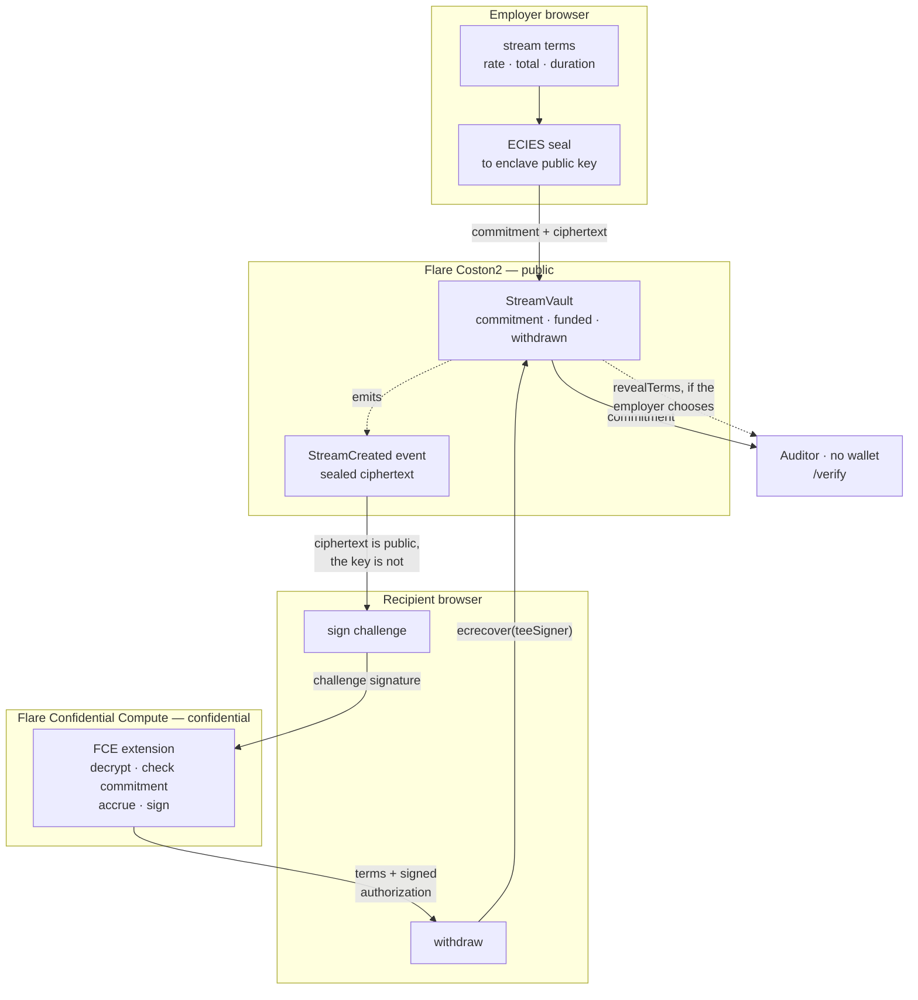
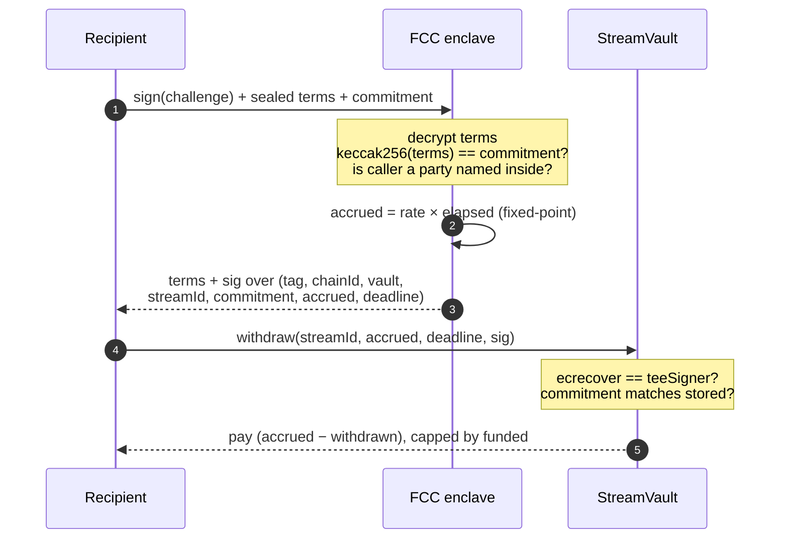

# StealthWage

**Private payroll on Flare.** Stream salaries where the chain proves the payment
but never reveals the amount.

Built for **Flare Summer Signal** — **Bounty 2 (Confidential Compute Apps)** as
primary, **Bounty 1 (Interoperable Asset Products)** for the FXRP / USDT0
streaming leg.

---

## The problem

Every on-chain payroll product today publishes your salary. Sablier, Superfluid,
LlamaPay — the rate is a public storage slot. Paying a contractor on-chain means
publishing what they earn, permanently, to anyone who looks. That single fact is
why crypto-native teams still run payroll through a bank.

## What StealthWage does

Stream terms — rate, total, duration — are ECIES-encrypted **in the employer's
browser** to the public key of a Flare Confidential Compute enclave. Only a
`keccak256` commitment reaches the chain.

To withdraw, the recipient signs a challenge. The enclave decrypts the terms,
checks them against the on-chain commitment, computes accrual, and returns a
signed authorization. `StreamVault` verifies it with `ecrecover` and releases
exactly what accrued.

**Remove the enclave and nothing can be withdrawn.** Confidential compute is not
bolted onto this product; it is the execution path.

**Target user:** crypto-native teams paying contractors and employees, who need
payroll to be verifiable to an auditor without being public to everyone.

---

## Architecture

Plaintext terms exist in exactly two places: the employer's browser, and inside
the enclave. Everything else — the chain, the explorer, this app's own landing
page — sees a 32-byte commitment.



The enclave holds the only key that opens the terms, and its signature is the
only thing the vault accepts. **Remove the enclave and no withdrawal is
possible** — confidential compute is the execution path, not a feature layered on
top.

### Why the enclave needs no state, no chain access, and no indexer



Three properties fall out of that digest:

**The commitment is inside the signature.** A forged terms/commitment pair
produces a signature the vault rejects, so the enclave never needs to read chain
state to know it is being told the truth. No RPC, no indexer, no durable state —
TEE restarts are therefore harmless, and the withdrawal path does not touch the
parts of FCC that are still stabilising.

**Accounting is cumulative.** The enclave signs total-accrued-since-start; the
vault pays the delta against what was already withdrawn. Replaying an old
authorization is a no-op rather than a double-spend, so no nonce is required.

**Callers are authenticated.** The commitment and ciphertext are both public, so
without the challenge signature anyone could poll the enclave, diff
`cumulativeAccrued` between two calls, and derive the salary.

---

## See it working — no wallet required

| | |
|---|---|
| Live app | _deploying — URL to follow_ |
| Landing | `/` — live split panel: what the chain sees vs what the recipient sees |
| Audit record | `/verify/3` — verifies revealed terms against the on-chain commitment |
| Catch a lie | [the same page rejecting altered terms](#verify-that-the-verification-actually-works) |

`/` and `/verify` are deliberately wallet-free and RPC-only, so they work
for someone arriving cold with no extension installed.

### Verify that the verification actually works

Most projects claim their verification works. Open both links and watch one fail.

**Honest terms** → `/verify/3` — verdict `Terms match the on-chain commitment`,
both hashes identical.

**Altered terms** → `/verify/3?terms=0x0000000000000000000000000ba50b9001b2eccd3869cc73c07031dca1e114120000000000000000000000004010723c187cc8051551aa3d4ecba952550ee3cc000000000000000000000000c1a5b41512496b80903d1f32d6dea3a73212e71f000000000000000000000000000000000000000000000000000002a1b324b8f70000000000000000000000000000000000000000000000000000000005f5e100000000000000000000000000000000000000000000000000000000006a6b6e02f7226b8808ac6269ab0e3818a71058a01f39352618467c2c8ddaaa90c8410f6e`

One hex digit differs in the rate field — `…b8f6` becomes `…b8f7`, an employer
publishing nicer terms than they enforced. The verdict flips to **does NOT
match** and the hashes visibly diverge.

On a mismatch the page **refuses to render the decoded terms at all**. Only the
failed comparison is shown, so attacker-supplied data is never displayed as
though it were legitimate.

---

## How it uses Flare

**Flare Confidential Compute is the execution path**, not a privacy feature added
to a payments app. The enclave holds the only key that opens the stream terms,
and its signature is the only thing the vault will accept. The three properties
that follow from that — stateless enclave, cumulative accounting, authenticated
callers — are described under [Architecture](#architecture) above.

FXRP and USDT0 are the streamed assets, both 6-decimal tokens on Coston2. That
decimal count is why rates are held as 1e12 fixed-point: 10 FXRP/day is 115.7407…
raw units per second, and a plain integer rate would silently underpay by 0.64% —
which on a payroll product is the kind of bug that gets found in the demo.

---

## Audit Mode

An employer can voluntarily publish plaintext terms with `revealTerms`. The
contract accepts them only if `keccak256(terms) == commitment`, so an employer
cannot show one set of terms and have enforced another.

**A stream without published terms is not suspicious.** Confidentiality is the
default; disclosure is the exception the employer chooses. Any audit tool built
on this — `/verify` included — has to say so, or it quietly inverts the
product's guarantee.

---

## Deployed — Flare Coston2 (chain 114)

| Contract | Address |
|---|---|
| `StreamVault` | [`0xd235B90dc929f7B061EAefdE0C8f020B3Cff47D7`](https://coston2-explorer.flare.network/address/0xd235B90dc929f7B061EAefdE0C8f020B3Cff47D7) |
| FXRP (`FTestXRP`) | `0x0b6a3645c240605887a5532109323a3e12273dc7` |
| USDT0 (`USD₮0`) | `0xc1a5b41512496b80903d1f32d6dea3a73212e71f` |

A real confidential payment, end to end:

| Step | Transaction |
|---|---|
| `createStream` — commitment only | [`0x4384a2ad…`](https://coston2-explorer.flare.network/tx/0x4384a2adc5d0eb066a2d025704aff93c612c9cc654562e84ae27a23a00670846) |
| `fund` | [`0x6681cab5…`](https://coston2-explorer.flare.network/tx/0x6681cab5941aaa21f6d673614d56f6d13a7f0ce9351f2ea4c877be43531dd3a9) |
| `withdraw` — enclave-authorised | [`0x347bc318…`](https://coston2-explorer.flare.network/tx/0x347bc3183a47f1f8fbea30f3bc5257bd0181d0f40be308e4bead1ea97a9e4ccb) |
| `revealTerms` — Audit Mode | [`0x9b5b53ae…`](https://coston2-explorer.flare.network/tx/0x9b5b53ae47ddc315de99cd088026524f349c31d28b9a048386a0a8ae6099af94) |

---

## What existed before, and what was built here

Built on Flare's official
[`fce-extension-scaffold`](https://github.com/flare-foundation/fce-extension-scaffold),
baseline commit **`f48cafb`** (2026-07-28). The scaffold's history is preserved
rather than squashed, so the split is verifiable rather than asserted:

```bash
git remote add upstream https://github.com/flare-foundation/fce-extension-scaffold.git
git fetch upstream
git diff --stat upstream/main..main
# 55 files changed, 6564 insertions(+), 1412 deletions(-)
```

**Pre-existing (Flare's scaffold):** TEE node/proxy topology, the Docker stack,
three language implementations, registration tooling. Its README is preserved at
[`docs/SCAFFOLD.md`](docs/SCAFFOLD.md).

**Built during the hackathon:**

| Area | What |
|---|---|
| Contract | `contracts/StreamVault.sol` — commitment storage, cumulative replay-safe accounting, TEE-authorised withdraw/settle, Audit Mode |
| Enclave | `typescript/src/app/streamHandlers.ts` — decrypt, verify, accrue, sign; caller authentication |
| Protocol | `typescript/src/shared/protocol.ts` — one definition of terms encoding, digests and rate maths, imported by both enclave and browser |
| Frontend | `frontend/` — landing, `/verify`, employer `/app` |
| Tests | 17 Foundry + 66 TypeScript, including cross-language digest parity |
| Tooling | live-Coston2 e2e, golden-vector generator, browser-ciphertext verifier |

**Improved in the scaffold:** bumped `tee-node` v0.0.21 → v0.0.24 and `tee-proxy`
v0.0.18 → v0.0.21. The stale pin causes every data-provider vote to be silently
rejected, leaving the instruction queue permanently empty — a failure mode with
no error message. `scripts/bump-tee-versions.sh` performs the bump and verifies
the pins agree.

---

## What this does not hide

Stated here rather than buried, because a privacy product that overstates its
guarantees is worse than one that makes fewer of them.

**Withdrawal amounts and timing are public.** Frequent, regular withdrawals leak
the rate over time. Irregular or batched withdrawals preserve more.

**The counterparty graph is visible.** Employer, recipient and token are on
chain. What stays hidden is the rate, the total, and therefore the salary.

**This runs on a simulated TEE.** Flare Confidential Compute is pre-production;
`SIMULATED_TEE=true` is the supported path on Coston2 today. Production means
Confidential Space attestation with enclave-generated keys — the code path is
identical, the trust assumption is not.

---

## Running it

```bash
git clone https://github.com/oderahub/flare-stealthwage.git
cd flare-stealthwage
forge install
forge test
```

```bash
cd typescript && npm install && npm test
```

```bash
cd frontend && npm install && npm run dev
```

End-to-end against live Coston2 (needs a funded key in `.env`):

```bash
cd typescript && npm run e2e
```

---

## Roadmap

**Now:** recipient dashboard using sign-then-fetch. The recipient cannot decrypt
the terms themselves — they're sealed to the enclave — so an authenticated
request returns the terms alongside the authorization and the UI ticks accrual
locally.

**Next:** on-chain instruction routing via `TeeExtensionRegistry` as an
alternative to the direct enclave call; production Confidential Space
attestation; XRPL-funded streams through FAssets minting.

**Beyond:** dual-encryption to the recipient's key so terms survive independently
of the enclave; payroll-period batching to blunt withdrawal-timing leakage.

---

Built on [`fce-extension-scaffold`](https://github.com/flare-foundation/fce-extension-scaffold)
by the Flare Foundation. Flare Coston2, chain 114.
